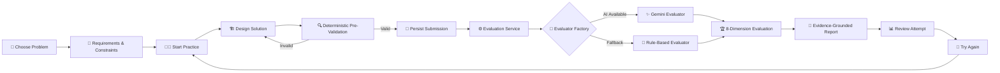
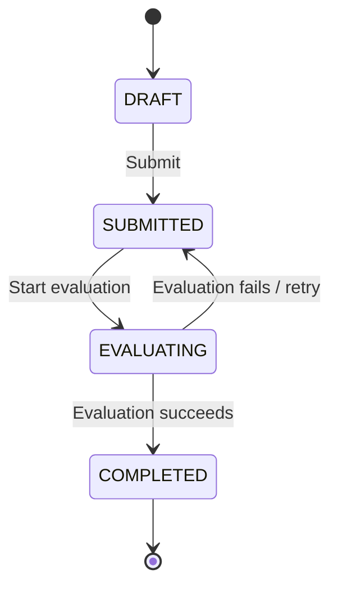
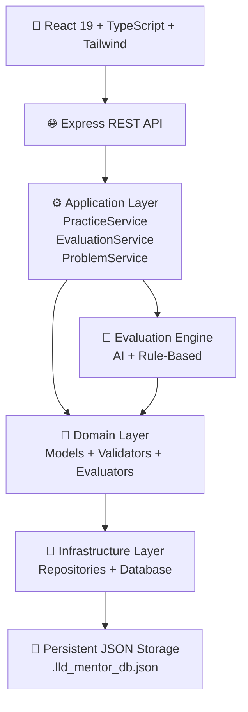

<div align="center">

<a href="https://github.com/Arul1414/LLD-Mentor">
  
</a>

<br/>


<br/><br/>

<a href="https://lldmentorr.vercel.app/">

</a>
<a href="https://github.com/Arul1414/LLD-Mentor">

</a>


<br/>

### 🧠 Practice LLD. Build Better Designs. Get Explainable Feedback.

**LLD Mentor** is a full-stack, type-safe platform for practicing Low-Level Design through structured problems, deterministic pre-validation, evidence-grounded AI evaluation, and an 8-dimension engineering rubric.

</div>

---

# 🧭 Navigation

<details open>
<summary><b>Explore LLD Mentor</b></summary>

<br/>

|  # | Section                                                   | What you'll find             |
| -: | --------------------------------------------------------- | ---------------------------- |
| 01 | 🚀 [Overview](#-overview)                                 | What LLD Mentor is           |
| 02 | 🎯 [Problem](#-problem)                                   | Why this platform exists     |
| 03 | 💡 [Solution](#-solution)                                 | How LLD Mentor solves it     |
| 04 | ✨ [Key Features](#-key-features)                          | Core capabilities            |
| 05 | 🔄 [How It Works](#-how-it-works)                         | Complete learner journey     |
| 06 | 🤖 [AI Evaluation](#-ai-evaluation-engine)                | Dual evaluation architecture |
| 07 | 🏆 [Rubric](#-8-dimension-evaluation-rubric)              | Evaluation dimensions        |
| 08 | 🛡️ [Reliability](#️-zero-data-loss--reliable-evaluation) | Persistence-first design     |
| 09 | 📚 [Problem Library](#-problem-library)                   | Practice problems            |
| 10 | 🏗️ [Architecture](#️-system-architecture)                | Application architecture     |
| 11 | 🧩 [Design Patterns](#-design-patterns--principles)       | Engineering patterns         |
| 12 | 🛠️ [Technology Stack](#️-technology-stack)               | Complete stack               |
| 13 | 📂 [Structure](#-project-structure)                       | Repository structure         |
| 14 | 🔌 [API](#-backend-api)                                   | Backend overview             |
| 15 | ⚡ [Quick Start](#-quick-start)                            | Run locally                  |
| 16 | 🧪 [Testing](#-testing--quality-assurance)                | Test strategy                |
| 17 | 🧠 [Technical Decisions](#-technical-decisions)           | Why it is built this way     |
| 18 | 📈 [Scalability](#-scalability-direction)                 | Future architecture          |
| 19 | 🗺️ [Roadmap](#️-roadmap)                                 | Planned improvements         |
| 20 | 📖 [Documentation](#-documentation)                       | Supporting docs              |
| 21 | 🤝 [Contributing](#-contributing)                         | Contribution guide           |
| 22 | 👨‍💻 [Developer](#-developer)                            | Project author               |

</details>

---

# 🚀 Overview

<div align="center">


</div>

**LLD Mentor** transforms Low-Level Design practice into a structured engineering workflow.

Instead of simply asking an AI to "review my design", the platform combines:

```text
Structured Practice
        ↓
Deterministic Validation
        ↓
Persistence
        ↓
AI / Rule-Based Evaluation
        ↓
8-Dimension Rubric
        ↓
Evidence-Grounded Feedback
        ↓
Attempt History
        ↓
Progressive Practice
```

The platform is designed around an important principle:

> **An evaluation should explain why a design received its score — not just provide a score.**

---

# 🎯 Problem

Traditional LLD preparation often has four major gaps:

| Challenge                | Traditional Experience                                   |
| ------------------------ | -------------------------------------------------------- |
| 🧩 Unstructured Practice | Learners solve problems without a consistent workflow    |
| 🤖 Generic AI Feedback   | AI feedback may be broad or insufficiently grounded      |
| 💾 Lost Work             | Evaluation failures can risk losing submitted designs    |
| 📊 No Progression        | Difficult to compare attempts and improve systematically |

LLD Mentor addresses these through **structured practice, deterministic validation, persistence-first evaluation, and evidence-based feedback**.

---

# 💡 Solution

<div align="center">

| 🧩 Challenge                | 🧠 LLD Mentor Approach                                 |
| --------------------------- | ------------------------------------------------------ |
| Unstructured LLD practice   | Guided problem → requirements → workspace → evaluation |
| Invalid designs             | Deterministic pre-validation                           |
| Generic feedback            | Evidence-grounded rubric evaluation                    |
| AI unavailable              | Rule-based deterministic fallback                      |
| Evaluation failure          | Persist before evaluation                              |
| Lost submissions            | Retryable evaluation state                             |
| Difficult progress tracking | Attempt history                                        |

</div>

---

# ✨ Key Features

<table>
<tr>
<td width="50%">

### 🧠 Structured LLD Practice

* Problem-based learning
* Requirements & constraints
* Design workspace
* Classes & relationships
* Responsibilities
* Trade-offs
* Optional code

</td>
<td width="50%">

### 🤖 Dual Evaluation Engine

* Gemini-powered evaluator
* Deterministic evaluator
* Automatic fallback
* Structured evaluation output
* Evidence citations
* Confidence indicator

</td>
</tr>

<tr>
<td>

### 🛡️ Persistence-First

* Submission persisted before evaluation
* `SUBMITTED` state
* `EVALUATING` state
* Retry-safe evaluation
* Failed evaluation does not erase work

</td>
<td>

### 📊 Explainable Feedback

* 8 evaluation dimensions
* 1–10 scoring
* Evidence from submitted design
* Architectural concerns
* Actionable suggestions
* Attempt history

</td>
</tr>
</table>

---

# 🔄 How It Works



---

# 🤖 AI Evaluation Engine

LLD Mentor does **not depend exclusively on AI**.

It uses a dual-engine architecture:

```text
                    ┌──────────────────────┐
                    │   User Submission    │
                    └──────────┬───────────┘
                               ↓
                    ┌──────────────────────┐
                    │ Deterministic        │
                    │ Pre-Validator        │
                    └──────────┬───────────┘
                               ↓
                    ┌──────────────────────┐
                    │ Persistence Layer    │
                    └──────────┬───────────┘
                               ↓
                    ┌──────────────────────┐
                    │ Evaluator Factory    │
                    └──────────┬───────────┘
                         ┌─────┴─────┐
                         ↓           ↓
                  ┌───────────┐ ┌──────────────┐
                  │ AI        │ │ Rule-Based   │
                  │ Evaluator │ │ Evaluator    │
                  └─────┬─────┘ └──────┬───────┘
                        └──────┬────────┘
                               ↓
                    ┌──────────────────────┐
                    │ Structured Evaluation│
                    └──────────┬───────────┘
                               ↓
                    ┌──────────────────────┐
                    │ Evidence + Score +   │
                    │ Suggestions          │
                    └──────────────────────┘
```

## ✨ AI Evaluator

Powered through:


The AI evaluator uses the Gemini API through `@google/genai` to evaluate designs across eight software-engineering dimensions.

The evaluation is designed to reference concrete design evidence such as:

* Class names
* Method signatures
* Responsibilities
* Relationships
* Architectural choices
* Design trade-offs

---

## 📐 Rule-Based Evaluator

The deterministic evaluator checks structural invariants and design requirements.

It provides a fallback path when AI evaluation is unavailable.

```text
AI Evaluation Available
        │
        ├── YES → Gemini Evaluator
        │
        └── NO → Rule-Based Evaluator
```

This creates a resilient evaluation pipeline rather than making the application entirely dependent on an external AI service.

---

# 🏆 8-Dimension Evaluation Rubric

|  # | Dimension                     | What is Evaluated                                        |
| -: | ----------------------------- | -------------------------------------------------------- |
| 01 | 🎯 Requirement Understanding  | Understanding of functional requirements and constraints |
| 02 | 🧩 Class Responsibilities     | Responsibility distribution and SRP                      |
| 03 | 🔗 Coupling / Cohesion        | Dependency relationships and class cohesion              |
| 04 | 🔒 Encapsulation / Interfaces | Encapsulation and abstraction boundaries                 |
| 05 | 🧠 Abstraction / Patterns     | Appropriate abstractions and design patterns             |
| 06 | 🔄 Extensibility              | OCP and future change handling                           |
| 07 | ⚠️ Edge Cases / Concurrency   | Failure cases and concurrency considerations             |
| 08 | 📝 Explanation & Trade-offs   | Reasoning, alternatives and trade-offs                   |

### Each criterion provides

```text
Score
  +
Evidence
  +
Architectural Concerns
  +
Actionable Suggestions
  +
Confidence
```

---

# 🛡️ Zero Data Loss & Reliable Evaluation

One of the key architectural decisions is:

> **Persist the submission before starting evaluation.**

### Submission Lifecycle



This means an evaluation failure does not mean the learner's design disappears.

### Reliability Flow

```text
User submits design
        ↓
Validate
        ↓
Persist submission
        ↓
Mark EVALUATING
        ↓
Run evaluator
        ↓
Success ─────────→ COMPLETED
        │
        └─────────→ Retry
```

---

# 📚 Problem Library

LLD Mentor currently provides three benchmark problems.

<table>
<tr>
<th>Problem</th>
<th>Difficulty</th>
<th>Core Concepts</th>
</tr>

<tr>
<td>🚗 <b>Parking Lot</b></td>
<td>🟡 Medium</td>
<td>Multi-tier allocation, ticket vouchers, rate strategies, concurrency protection</td>
</tr>

<tr>
<td>🥤 <b>Vending Machine</b></td>
<td>🟢 Easy</td>
<td>State Pattern, inventory management, cash bank & change calculation</td>
</tr>

<tr>
<td>🛗 <b>Elevator System</b></td>
<td>🔴 Hard</td>
<td>LOOK/SCAN dispatch, multiple cabins, hall/cabin calls, door invariants</td>
</tr>

</table>

---

# 🏗️ System Architecture



---

# 🧩 Design Patterns & Principles

LLD Mentor itself applies Low-Level Design principles internally.

| Pattern / Principle          | Usage                                                                        |
| ---------------------------- | ---------------------------------------------------------------------------- |
| 🏭 **Factory Pattern**       | `EvaluatorFactory` selects evaluation strategy                               |
| 🔀 **Strategy Pattern**      | AI and Rule-Based evaluators implement interchangeable evaluation strategies |
| 🗃️ **Repository Pattern**   | Abstracts persistent data access                                             |
| 🧠 **Service Layer**         | Encapsulates application workflows                                           |
| 🧩 **Domain-Driven Design**  | Separates domain models and business rules                                   |
| 🎯 **Single Responsibility** | Separates validation, evaluation, persistence and application services       |
| 🔓 **Open/Closed Principle** | Supports additional evaluator implementations                                |
| 🔒 **Encapsulation**         | Keeps domain invariants inside appropriate boundaries                        |

---

# 🎨 Technology Stack

<div align="center">

## Frontend


<br/><br/>


<br/><br/>

## Backend & Runtime


<br/><br/>


<br/><br/>

## AI & Evaluation


<br/><br/>

## UI & Developer Experience


</div>

---

# ⚙️ Technology Stack — Detailed

## 01. Frontend Layer

### ⚛️ React 19

Modern component architecture using functional components and hooks such as:

* `useMemo`
* `useRef`
* Custom Hooks

### 🔷 TypeScript

Strict end-to-end typing for:

* Domain models
* Intermediate representations
* Component contracts
* API data

### 🎨 Tailwind CSS v4

Utility-first styling with:

* Native CSS theme variables
* Zero-runtime overhead
* Modern responsive UI

### ⚡ Vite

Provides:

* Fast development builds
* Modern bundling
* Optimized production assets

### 🧩 Lucide React

Used for consistent iconography across:

* Problems
* Metrics
* Rubric criteria
* Status indicators

### ✨ Motion

Declarative animations for:

* Workspace transitions
* Modal dialogs
* UI interactions

---

# 🖥️ Backend & Server Runtime

### 🟢 Node.js

JavaScript runtime powering backend services.

### 🚂 Express.js

REST API server handling:

* Problems
* User attempts
* Submissions
* Evaluation processing

### ⚡ TSX

Runs TypeScript directly in the Node.js environment without requiring a separate pre-compilation workflow during development.

### 🔌 Vite Dev Server Middleware

The Vite development server is mounted within Express so the frontend SPA and backend API can operate through a unified development server.

---

# 🧠 AI & Evaluation Architecture

```text
┌───────────────────────────────────────────────┐
│               Evaluation Layer                │
├───────────────────────────────────────────────┤
│                                               │
│   ┌─────────────────┐   ┌─────────────────┐   │
│   │  AI Evaluator   │   │ Rule-Based      │   │
│   │  Gemini API     │   │ Evaluator       │   │
│   └────────┬────────┘   └────────┬────────┘   │
│            │                     │            │
│            └──────────┬──────────┘            │
│                       ↓                       │
│              Evaluator Factory               │
│                       ↓                       │
│               Structured Report              │
│                                               │
└───────────────────────────────────────────────┘
```

Supported evaluation modes:

```text
AI
RULE_BASED
AUTO
```

The architecture allows evaluator implementations to be exchanged without tightly coupling the rest of the application to one evaluation mechanism.

---

# 💾 Data Persistence

LLD Mentor uses a document-oriented persistence approach with:

```text
In-Memory Cache
       +
Persistent JSON Store
       ↓
.lld_mentor_db.json
```

The system is pre-seeded with benchmark LLD problems.

Repository abstractions include:

```text
ProblemRepository
AttemptRepository
SubmissionRepository
EvaluationRepository
```

---

# 📂 Project Structure

```text
LLD-Mentor/
│
├── backend/
│   ├── src/
│   │   ├── domain/
│   │   │   ├── models/
│   │   │   │   ├── Problem
│   │   │   │   ├── Submission
│   │   │   │   ├── Attempt
│   │   │   │   └── Evaluation
│   │   │   │
│   │   │   ├── validators/
│   │   │   │   └── SubmissionValidator
│   │   │   │
│   │   │   └── evaluators/
│   │   │       ├── Evaluator
│   │   │       ├── RuleBasedEvaluator
│   │   │       ├── AIEvaluator
│   │   │       └── EvaluatorFactory
│   │   │
│   │   ├── infrastructure/
│   │   │   ├── database/
│   │   │   └── repositories/
│   │   │
│   │   ├── application/
│   │   │   └── services/
│   │   │       ├── ProblemService
│   │   │       ├── PracticeService
│   │   │       └── EvaluationService
│   │   │
│   │   └── routes/
│   │
│   └── tests/
│       └── lld-mentor.test.ts
│
├── src/
│   ├── components/
│   ├── pages/
│   ├── services/
│   └── types/
│
├── server.ts
├── RESEARCH.md
├── DESIGN.md
├── AI_USAGE.md
└── package.json
```

---

# 🔌 Backend API

The backend exposes REST API routes under:

```text
/api/*
```

The API layer is responsible for operations related to:

```text
Problems
   ↓
Attempts
   ↓
Submissions
   ↓
Evaluation
   ↓
Reports
```

The implementation keeps HTTP routing separated from domain and application logic.

---

# ⚡ Quick Start

## 1️⃣ Clone

```bash
git clone https://github.com/Arul1414/LLD-Mentor.git
cd LLD-Mentor
```

## 2️⃣ Install Dependencies

```bash
npm install
```

## 3️⃣ Configure Gemini

If AI evaluation is required, configure:

```env
GEMINI_API_KEY=your_api_key
```

Without the Gemini API key, the platform can use the deterministic rule-based evaluator.

## 4️⃣ Start Development Server

```bash
npm run dev
```

Development server:

```text
http://0.0.0.0:3000
```

## 5️⃣ Run Tests

```bash
npm test
```

## 6️⃣ Type Check

```bash
npx tsc --noEmit
```

---

# 🧪 Testing & Quality Assurance

LLD Mentor uses the **Node.js Native Test Runner** for automated testing.

### Test Coverage Areas

| Test Area                | Purpose                                         |
| ------------------------ | ----------------------------------------------- |
| 🆕 Attempt Creation      | Verifies creation workflow                      |
| ✅ Valid Submission       | Validates accepted designs                      |
| ❌ Empty Submission       | Ensures invalid submissions are rejected        |
| 🔄 State Transitions     | Verifies lifecycle changes                      |
| 🧠 Rule-Based Evaluation | Tests 8-dimension scoring                       |
| 🛡️ Failure Handling     | Verifies persistence during evaluation failures |
| 📚 Attempt History       | Validates historical records                    |
| 🚫 Duplicate Detection   | Prevents duplicate submissions                  |

### Static Type Checking

```bash
npx tsc --noEmit
```

This verifies strict TypeScript correctness without generating output files.

---

# 🧠 Technical Decisions

## Why deterministic validation before AI?

AI should evaluate a meaningful submission rather than replace basic structural validation.

```text
Input
 ↓
Deterministic Validation
 ↓
Valid Design
 ↓
AI Evaluation
```

This separates **structural correctness** from **qualitative reasoning**.

---

## Why persist before evaluation?

External evaluation can fail.

Therefore:

```text
Persist First
     ↓
Evaluate Second
```

The user's work remains available even if evaluation needs to be retried.

---

## Why Strategy Pattern?

Different evaluation mechanisms should be interchangeable.

```text
Evaluator
   ├── AIEvaluator
   └── RuleBasedEvaluator
```

This allows the platform to evolve without redesigning the complete evaluation workflow.

---

## Why Factory Pattern?

The factory centralizes evaluator selection:

```text
EvaluatorFactory
      ↓
AI
RULE_BASED
AUTO
```

This keeps selection logic separate from business workflows.

---

# 📈 Scalability Direction

The architecture is designed so additional capabilities can be introduced without rewriting the core domain workflow.

Potential future extensions include:

```text
More Evaluators
       ↓
More LLD Problems
       ↓
User Profiles
       ↓
Progress Analytics
       ↓
Interview Mode
       ↓
Custom Rubrics
       ↓
Collaborative Practice
```

These are **future directions**, not claims about currently implemented functionality.

---

# 🗺️ Roadmap

| Feature                           | Status |
| --------------------------------- | :----: |
| 🎯 Structured LLD Practice        |    ✅   |
| 📐 Deterministic Pre-Validation   |    ✅   |
| 🤖 Gemini Evaluation              |    ✅   |
| 📊 8-Dimension Rubric             |    ✅   |
| 🛡️ Persistence Before Evaluation |    ✅   |
| 🔁 Retry-Safe Evaluation          |    ✅   |
| 📚 Attempt History                |    ✅   |
| 🚗 Parking Lot Problem            |    ✅   |
| 🥤 Vending Machine Problem        |    ✅   |
| 🛗 Elevator System Problem        |    ✅   |
| 👤 User Profiles                  |   🔜   |
| 📈 Advanced Analytics             |   🔜   |
| 🎤 Interview Mode                 |   🔜   |
| 🧩 More Problem Types             |   🔜   |
| 🏆 Custom Rubrics                 |   🔜   |
| 🤝 Collaborative Practice         |   🔜   |

---

# 📖 Documentation

Additional engineering documentation is included in the repository:

| Document      | Purpose                          |
| ------------- | -------------------------------- |
| `RESEARCH.md` | Research and supporting analysis |
| `DESIGN.md`   | System and architectural design  |
| `AI_USAGE.md` | AI usage and evaluation details  |

---

# 🌐 Live Project

<div align="center">

<a href="https://lldmentorr.vercel.app/">


</a>

<br/><br/>

**Experience the platform live:**

### [🔗 lldmentorr.vercel.app](https://lldmentorr.vercel.app/)

</div>

---

# ⭐ GitHub Repository

<div align="center">

<a href="https://github.com/Arul1414/LLD-Mentor">


</a>

<br/><br/>

### [🔗 github.com/Arul1414/LLD-Mentor](https://github.com/Arul1414/LLD-Mentor)

</div>

---

# 🤝 Contributing

Contributions and improvements are welcome.

```text
Fork
 ↓
Create Feature Branch
 ↓
Implement
 ↓
Run Tests
 ↓
Type Check
 ↓
Commit
 ↓
Open Pull Request
```

Before submitting changes:

```bash
npm test
npx tsc --noEmit
```

---

# 👨‍💻 Developer

<div align="center">


### Arulmani

**Full-Stack Developer • AI Engineering • Low-Level Design**

<br/>

<a href="https://github.com/Arul1414">

</a>

</div>

---

# 📜 License

> Add the project's chosen open-source license here.

---

<div align="center">


### 🧠 Design. Validate. Evaluate. Improve.

**LLD Mentor — turning LLD practice into an engineering feedback loop.**

<br/>


<br/><br/>

⭐ **If this project helped you understand or practice LLD, consider starring the repository.**

</div>
